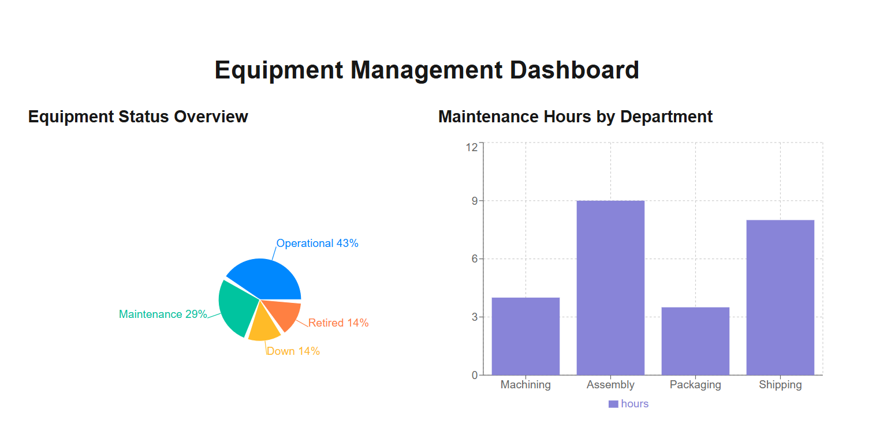
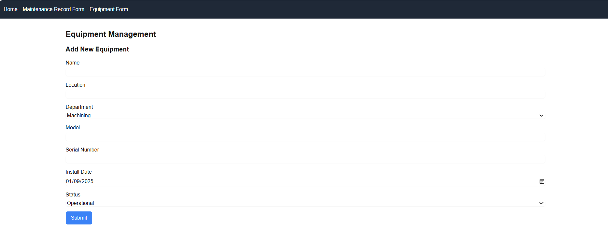
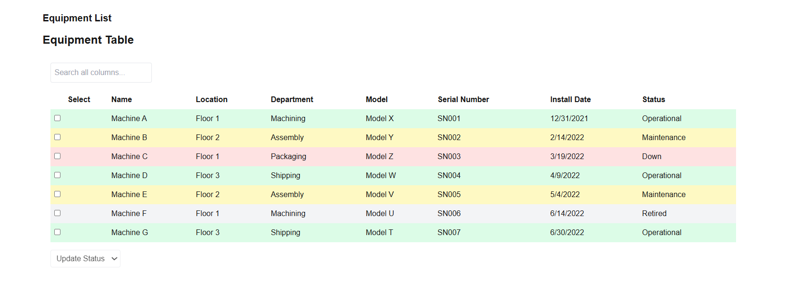
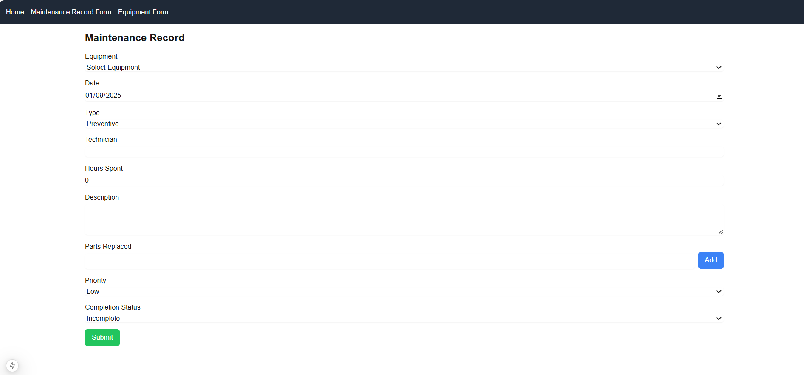
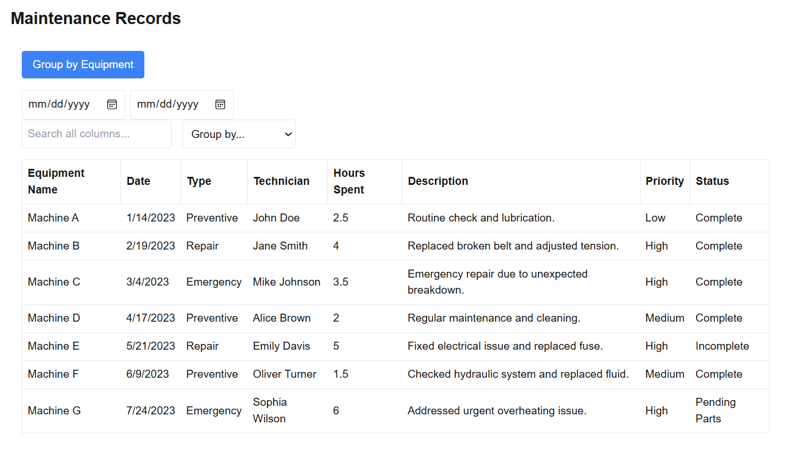
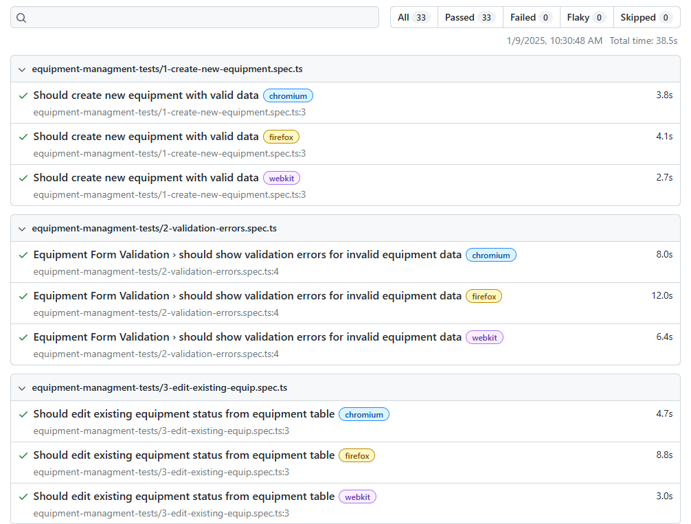
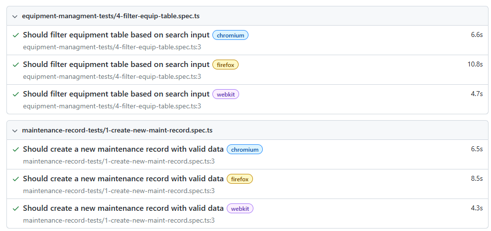
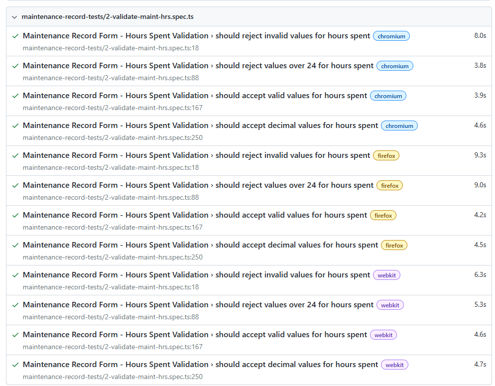
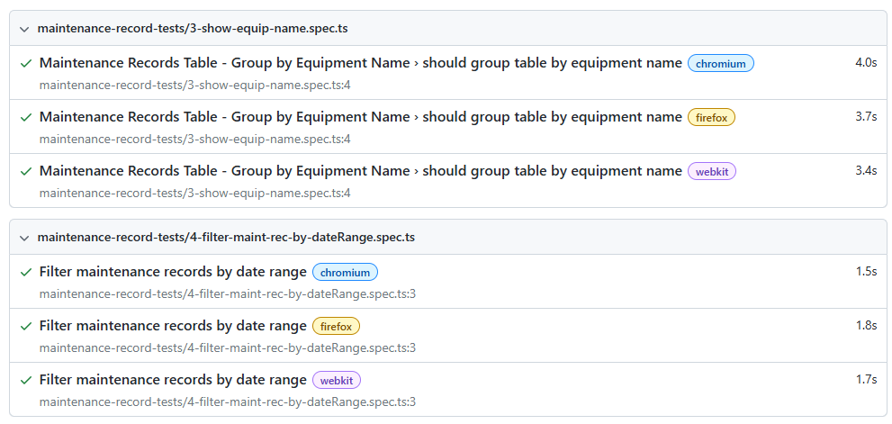

# Maintenance Tracking System

## Overview
This project is a simple maintenance tracking system that allows technicians to log maintenance activities on equipment and visualize basic maintenance metrics. It was developed as part of a React Coding Challenge.

## Setup Instructions

### Prerequisites
- Node.js (latest stable version)
- npm

### Installation Steps
1. Clone the repository **** https://github.com/NnaHill/react-coding-challenge-maintenance-tracking-system.git

2. Navigate to the project directory  ***  cd maintenance
3. Install dependencies ***    npm install

### How to Run the Application
1. Start the development server    npm run dev
2. Open a web browser and navigate to `http://localhost:3000`

### How to Run Tests
Run the E2E tests using Playwright: npm run test:e2e

## Features Implementation

### List of Completed Features
1. Equipment Management
   - Equipment form with validation
   - Equipment table with sorting, filtering, and bulk updates
2. Maintenance Records
   - Maintenance record form with validation
   - Maintenance records table with sorting, filtering, and grouping
3. Dashboard
   - Equipment status breakdown (pie chart)
   - Maintenance hours by department (bar chart)
   - Recent maintenance activities list

### Screenshots of Key Features
#### Dashboard

#### Equipment Management

#### Maintenance Records

## Testing Approach

### Testing Strategy
We use Playwright for End-to-End (E2E) testing to ensure the application functions correctly from a user's perspective.

### What is Tested and Why
- Equipment Management: To ensure proper creation, editing, and filtering of equipment data.
- Maintenance Records: To verify correct creation, validation, and filtering of maintenance records.

### How to Run Different Types of Tests
All our E2E tests report files:

## Technical Decisions

### Key Libraries Used and Why
- Next.js with TypeScript: For server-side rendering and type safety
- Tailwind CSS: For rapid and responsive UI development
- Tanstack Table: For powerful and flexible table components
- Recharts: For creating interactive and customizable charts
- Zod: For robust form validation
- Playwright: For reliable and fast E2E testing

### Architecture Decisions
- The application follows a component-based architecture using React and Next.js.
- Server-side rendering is utilized for improved initial load times and SEO.
- TypeScript is used throughout the project for enhanced type safety and developer experience.

### State Management Approach
We use React's built-in useState hook to manage the component's state. This allows us to keep track of various pieces of information that can change as the user interacts with the table.

## Known Issues/Limitations

### Current Bugs or Limitations

### Future Improvements
- Implement user authentication and authorization
- Add more detailed reporting features
- Improve mobile responsiveness

